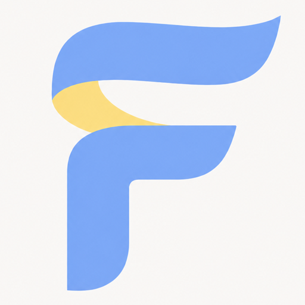

# FluxGen

<p align="center">
  
</p>

<p align="center"><strong>Turn a plain-English idea into a desktop wallpaper from your terminal.</strong></p>

<p align="center">
  <a href="https://flux-gen.moriatz.com">Website</a> ·
  <a href="#install">Install</a> ·
  <a href="#api-key-setup">API key setup</a> ·
  <a href="#commands">Commands</a>
</p>

FluxGen is a small Bun-powered TypeScript CLI. It can improve your description with focused wallpaper skills, render the image through DEAPI, save it to your operating system's `Pictures/FluxGen` directory, and immediately set it as your wallpaper.


## Install

macOS:

```sh
curl -fsSL https://flux-gen.moriatz.com/install.sh | sh
```

Windows PowerShell:

```powershell
irm https://flux-gen.moriatz.com/install.ps1.txt | iex
```

The installers download the latest native binary from GitHub Releases and verify its SHA-256 checksum before installing it.

## Quick start

After installation, download the local prompt model and runtime, then run the guided setup for image generation:

```sh
flux local install
flux setup
```

Flux defaults to the frozen local Qwen prompt writer. It needs no prompt-provider API key. DEAPI still renders images and requires its own key, stored in your operating system credential store. Existing users keep their selected provider until they run `flux local install` or choose `flux-local` with `flux -pm`.

Run `flux local start` in a separate terminal and leave it open. Preview text with `flux prompt "a quiet embroidered coastline"`, or generate an image with the command below. The model download is about 2.50 GB; allow at least 6 GB free disk space. Windows defaults to NVIDIA CUDA; use `flux local install --cpu` on Windows without NVIDIA. macOS uses native Intel/Apple Silicon runtimes. CPU inference can be considerably slower; laptop measurements are not a guarantee for other hardware.

Then generate:

```sh
flux a quiet observatory above the clouds at blue hour
```

After saving a wallpaper in an interactive terminal, Flux asks whether you want to create another. Choose **Yes** to enter the next description without restarting the command, or **No** to exit. Redirected and automated commands always generate once and exit.

Use `flux config` to confirm the selected models, output directory, enhancement setting, update mode, masked key status, and whether each active key comes from the environment or operating-system keychain.

## API key setup

### 1. Create a DEAPI key

DEAPI is always required because it renders the wallpaper.

1. Open the [DEAPI API Keys page](https://app.deapi.ai/settings/api-keys) and sign up or sign in.
2. Open **Dashboard → Settings → API Keys**.
3. Select **Create new secret key**.
4. Confirm that the account has sufficient credits.
5. Run `flux setup` and paste the key at the hidden prompt.

Follow the official [DEAPI quickstart](https://docs.deapi.ai/quickstart) for the current dashboard and billing flow.

### 2. Optionally choose a prompt provider

Local prompt enhancement is enabled by default and needs no provider key. Cloud prompt models are optional compatibility choices. Add only the key belonging to a cloud model you explicitly select. If a selected cloud provider has no key, Flux can use built-in wallpaper heuristics; this is separate from the local language model.

Choose a model during `flux setup` or change it later with `flux -pm`:

| Provider | Prompt models |
| --- | --- |
| Local (default) | `flux-local` — frozen Qwen3-4B positive-v2 |
| OpenAI | `gpt-5.6-luna`, `gpt-5.6-terra`, `gpt-5.6-sol` |
| Google | `gemini-3.6-flash` |
| Anthropic | `claude-haiku-4-5`, `claude-sonnet-5`, `claude-opus-5` |

Luna and Haiku favor cost and speed, Terra and Sonnet balance quality with cost, and Sol and Opus favor maximum prompt quality. Provider access and billing still determine which models an API key can use. Run `flux models` to see the complete prompt roster and the live DEAPI image-model catalogue.

When a cloud prompt model is selected without its key, interactive generation asks four quick visual questions:

1. Visual style — for example photographic, illustrated, pixel art, abstract, or cinematic.
2. Lighting — for example soft daylight, golden hour, blue hour, dramatic, or neon.
3. Composition — centered, off-center, minimal, or layered panorama.
4. Color mood — warm, cool, dark, vibrant, or earthy.

Every question defaults to **Auto**. Press Enter to skip any individual question and let Flux infer that answer. Automated and redirected commands skip all four questions and infer these decisions from the original sentence. In both cases Flux adds a full-bleed 16:9 composition, desktop-safe calm edges, atmospheric depth, controlled color, tactile detail, and a clean image-only field before sending the prompt to DEAPI.

| Provider | How to create the key | Store it under |
| --- | --- | --- |
| OpenAI | Create a project API key using the [OpenAI developer quickstart](https://developers.openai.com/api/docs/quickstart). Configure API billing if the account requires it. | **OpenAI** |
| Google Gemini | Create the current restricted/auth key in Google AI Studio using the [Gemini API key guide](https://ai.google.dev/gemini-api/docs/api-key). | **Google Gemini** |
| Anthropic | Open Claude Console **Settings → API keys**, create a key, and choose an appropriate expiration as described in [Anthropic authentication](https://platform.claude.com/docs/en/manage-claude/authentication). | **Anthropic** |

Run `flux config key` after creating the key, choose the matching provider, and select **Add or replace**. Flux stores entered keys in the native operating-system credential store rather than a project file.

To replace or remove a stored key, run the same command and choose the appropriate action. `flux config` reports only whether each key is configured; it never prints the secret.

### Use FluxGen without prompt enhancement

If you want your original description sent directly to DEAPI, turn enhancement off:

```sh
flux config enhancement
```

Choose **No**. In this mode, only the DEAPI key is required and wallpaper skills are not applied.

### Environment variables

For automation or CI, these environment variables override keys stored in the operating-system credential store:

| Variable | Provider |
| --- | --- |
| `DEAPI_API_KEY` | DEAPI |
| `OPENAI_API_KEY` | OpenAI |
| `GEMINI_API_KEY` | Google Gemini |
| `ANTHROPIC_API_KEY` | Anthropic |

FluxGen does not load project `.env` files. Store automation credentials in the secret manager provided by your CI or operating system. Never put a real key in source code, commits, issues, screenshots, command examples, or shell history.

## Updates

Check for a newer release without changing anything:

```sh
flux update --check
```

Download, checksum-verify, and install the latest release:

```sh
flux update
```

Choose automatic installation, notification-only checks, or disable update checks:

```sh
flux config updates
```

Update checks run at most once every 24 hours. Automatic updates use the same public, checksum-verifying installers as first-time installation. Windows finishes replacing the executable after the current Flux command exits; macOS updates it immediately.

## Commands

| Command | Purpose |
| --- | --- |
| `flux <description>` | Generate and save a wallpaper |
| `flux` | Open the interactive description prompt |
| `flux setup` | Set up keys, models, and wallpaper behavior |
| `flux config` | View nonsecret configuration and key status |
| `flux config key` | Add, replace, or remove an API key |
| `flux config enhancement` | Turn prompt enhancement on or off |
| `flux config wallpaper` | Apply new wallpapers immediately or save them only |
| `flux config updates` | Choose automatic, notification-only, or disabled update checks |
| `flux prompt-model`, `flux -pm` | Select the prompt model |
| `flux image-model`, `flux -im` | Select a live DEAPI image model |
| `flux models` | List prompt models and live DEAPI image models |
| `flux skills` | List bundled, personal, and project skills |
| `flux wallpaper next` | Immediately rotate to another saved Flux wallpaper |
| `flux update --check` | Check for a newer release |
| `flux update` | Install the latest checksum-verified release |
| `flux --help` | Show command help |

## Desktop wallpaper

Each generated image is saved in `Pictures/FluxGen` and immediately applied as the current wallpaper.

- **Windows:** Flux applies the image through the native desktop API.
- **macOS:** Flux applies the image through System Events. macOS may ask for Automation permission the first time.

Flux does not create a scheduled task or background process. Run `flux config wallpaper` if you prefer to save new images without applying them.

## Wallpaper skills

FluxGen bundles nine focused skills for composition, lighting, photography, illustration, abstraction, environments, color direction, and vivid tactile art direction. The foundation and art-direction rules are always applied when enhancement is enabled—even without a prompt-model key, where equivalent deterministic heuristics run locally.

Add your own skills at:

- Personal: `~/.flux/skills/<name>/SKILL.md`
- Project: `.flux/skills/<name>/SKILL.md`

Project skills override personal skills, which override bundled skills with the same name. FluxGen reads only `SKILL.md`; it never executes skill scripts or loads their assets and references.

## Troubleshooting

- **DEAPI key missing:** run `flux config key` and add the DEAPI key, or configure `DEAPI_API_KEY` in your automation environment.
- **DEAPI returns 401:** the key may have been pasted incorrectly. Flux offers to configure it again immediately, trims surrounding whitespace, and validates the replacement before accepting it. `flux config` shows whether the active value comes from the environment or keychain.
- **DEAPI returns 403:** Flux offers the same recovery prompt. If the replacement is accepted but 403 continues, verify that the key can use the requested model and that the account has sufficient credits.
- **Prompt-provider key missing or rejected:** Flux uses its local wallpaper director and continues with DEAPI. In an interactive terminal it asks about style, lighting, composition, and color; automation uses inferred defaults.
- **No image models appear:** check the DEAPI key and account balance, then run `flux models` again.
- **A key still shows as environment:** environment variables take precedence. Remove or update that variable outside FluxGen.
- **Command not found after installation:** open a new terminal so the installer's PATH update is loaded.

## Development

Requires [Bun](https://bun.sh/) 1.3.5 or newer.

Clone the public repository and install its locked dependencies:

```sh
git clone https://github.com/moriatz-labs/flux-gen.git
cd flux-gen
bun install --frozen-lockfile
```

Run the CLI, website, and full verification suite:

```sh
bun run dev -- a misty forest at dawn
bun run dev:website
bun run check
```

Build the native CLI and static website:

```sh
bun run build
```

Regenerate the website demo video with FFmpeg available on `PATH`:

```sh
bun run video
```

### Local prompt writer

`flux-local` is the default for new configurations. `flux local install` downloads checksum-pinned model shards and the official llama.cpp b10819 runtime, then selects local prompt writing. `flux local start` serves it only at `127.0.0.1:8080`. Leave that terminal open; Ctrl+C stops the server. Initial CUDA compilation may take several minutes; wait until the server is ready before sending requests.

```sh
flux prompt a quiet embroidered coastline
```

This command prints only an expanded prompt and does not require DEAPI or generate an image. Local refinement needs no provider API key, makes no cloud selection calls, and never falls back to a remote provider. If the local server is unavailable, Flux reports how to start it. Existing cloud model choices remain available.

Prompts normally contain 80–180 words and may contain up to 250. The writer is instructed to preserve explicit orientations and constraints, but can make mistakes; review the output when those details matter. The image renderer still controls supported dimensions. The model is distributed as separate release assets, not embedded in the executable. Training data and checkpoints remain outside this repository.

The frozen positive-v2 model is experimental: its 30-case blind Codex editorial comparison scored 36.7% against the stronger base-model baseline (ties counted as half), below the 60% target, with one explicit color violation. Format checks passed and no complete-prompt copying was flagged. It is released by maintainer choice, not as a proven quality improvement. Windows RTX 5070 Laptop testing measured a 1.55-second median across ten warm CLI requests and 3949 MiB peak total GPU usage. macOS and CPU quality/performance have not been measured. See [MODEL_CARD.md](MODEL_CARD.md).

### Add a prompt model

Flux keeps its selectable prompt models deliberately explicit:

1. Add the provider's exact API model ID to `promptModelIds` in `src/types.ts`.
2. Add its label and provider mapping to `promptModels` in `src/constants.ts`.
3. If it uses OpenAI, Google, or Anthropic, the existing adapter in `src/prompt-providers.ts` handles the request. A new provider also needs a provider ID, key URL, environment-variable mapping, credential-store option, and request adapter.
4. Add provider mapping and response-shape coverage in `tests/providers.test.ts`.
5. Update the model roster in `website/index.html` and run `bun run check`.

Use only model IDs documented by the provider. DEAPI image models do not need to be hard-coded: `flux -im` discovers its current text-to-image catalogue dynamically.

Native Windows x64, macOS x64, and macOS arm64 binaries are published with SHA-256 checksums for tagged releases. Linux is not currently supported.

## Security

See [SECURITY.md](SECURITY.md) for private vulnerability reporting. API keys and generated wallpapers remain local except when sent to the selected API providers to perform generation.

## License

FluxGen is available under the [MIT License](LICENSE).
